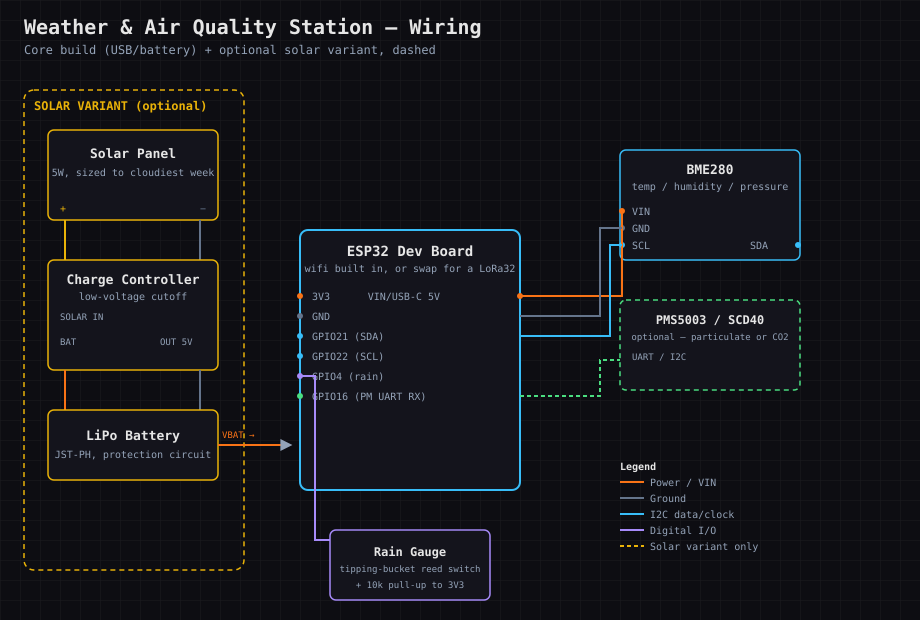
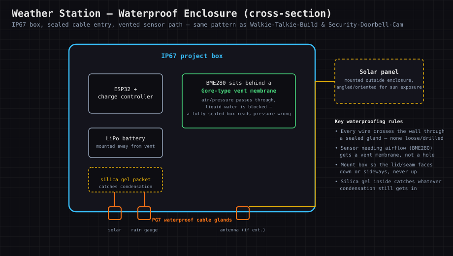

# Weather-And-Air-Quality-Station

### An outdoor sensor node reporting temperature, humidity, pressure, rain, and optionally air quality back to a dashboard — over wifi or long-range LoRa.

  

[📖 Lesson Plan](docs/LESSON_PLAN.md)

<!-- SCREENSHOT PLACEHOLDER: docs/screenshots/overview.png -->

> ⬜ **Scaffold pending.** Directory created to portfolio standard; full content to be built. Real-hardware build with an emulation/planning-first path. Part of **Chain K — Hardware & Systems Foundations**.

## Why This Was Built

This is the project that actually lives outside — everything else in Chain K can sit on a desk. Weather
stations force real decisions about power (no wall outlet outdoors), waterproofing (it rains on purpose
here), and long-running reliability (it has to survive weeks unattended), not just circuit theory.

## Hardware Buying Guide (What to look for & red flags)

**Parts list:** a BME280 (temperature/humidity/pressure, one cheap breakout covers all three), a tipping-
bucket rain gauge sensor, optionally a PMS5003 (PM2.5 particulate) or SCD40 (CO2) sensor for air quality, a
microcontroller (ESP32 is the easy choice — wifi built in), a solar panel + LiPo + charge controller for
outdoor power, and a waterproof enclosure.

**What to look for:** a solar charge controller with **low-voltage cutoff** (protects the LiPo from
over-discharge on cloudy weeks) is worth paying for over a bare panel+battery. Size the solar panel for
your cloudiest expected week, not your average day.

**Red flags:** "solar power bank" listings with no actual charge-controller IC specified, generic humidity
sensors with no datasheet (BME280 clones exist that drift badly), and rain gauges sold with no calibration
figure (mm per tip).

**Common failure points:** condensation inside a sealed enclosure (needs a vent with a membrane, not a
fully sealed box), battery undersized for winter's shorter solar days, and wifi range from an outdoor
mounting spot back to the router — LoRa avoids this entirely if wifi doesn't reach.

**Waterproofing** reuses the exact same pattern as **Walkie-Talkie-Build**'s waterproof option: IP67
enclosure, sealed cable glands, vented (not open) membrane where air needs to get in.

## Wiring Diagrams

**Core build, with the solar variant called out.** ESP32 (or a LoRa32 if reporting over LoRa instead of
wifi) reads the BME280 over I2C and the rain gauge's reed switch on a digital pin; the solar branch (dashed,
yellow) is a drop-in replacement for USB power — panel → charge controller (low-voltage cutoff) → LiPo →
ESP32:

**Waterproof enclosure, cross-section.** Everything inside an IP67 box, wires crossing the wall only through
sealed cable glands, and — the detail that trips people up — the BME280 sits behind a vent membrane rather
than a sealed wall, because a fully sealed box reads barometric pressure wrong:

## Parts & Pricing

Pulled from the chain-wide [Hardware Shopping List](../HARDWARE_SHOPPING_LIST.md#weather-and-air-quality-station)
— check there for current links; prices drift. **Budget/Mid/Luxury are the same tiers the shopping list
calls Budget/Mid/Premium.**

| Item | Budget | Mid | Luxury |
|---|---|---|---|
| Sensor | BME280 breakout (~$8) — temp/humidity/pressure | + basic rain gauge (~$15) | + PMS5003 particulate (~$25) or SCD40 CO2 (~$35) |
| Microcontroller | ESP32 dev board (~$8–12) | Same | Heltec LoRa32 V3 (~$20–25) if reporting over LoRa instead of wifi |
| **Solar power** *(optional variant)* | Generic 5W panel + basic controller (~$20) | Panel + controller **with low-voltage cutoff** (~$30–35) | Adafruit/Victron-class charge controller (~$20–40) + panel sized for your cloudiest week |
| **Waterproof enclosure** *(optional variant)* | Generic IP67 box + shared cable gland kit | [TICONN IP67 junction box, ~$25](https://www.amazon.com/TICONN-Waterproof-Electrical-Junction-Enclosure/dp/B0B87THLGC) | [Adafruit flanged weatherproof enclosure, ~$15–20](https://www.adafruit.com/product/3931) — glands pre-installed |

Running total, core build only: **~$16–17 budget → ~$23 mid → ~$55–60 luxury** (microcontroller + sensor).
Add the solar and waterproof rows if you're building the full outdoor version — most people building this
project want both, since it's the one project in the chain that has to survive outside unattended.

## Why This Matters (Industry Application)

This is a real IoT sensor-node deployment in miniature: power budgeting, intermittent connectivity, and
long-unattended-uptime are the same problems industrial and agricultural IoT deal with at scale.

## Topics Covered

| Area | What this project covers |
|------|--------------------------|
| Sensors | Temperature, humidity, pressure, rain, optionally air quality |
| Power | Solar charging, battery sizing, and low-voltage cutoff |
| Connectivity | Wifi vs. LoRa for a remote, low-bandwidth node |
| Weatherproofing | A real outdoor enclosure that survives rain and condensation |
| Data | Logging and dashboarding sensor readings over time |
| Reliability | Building something that runs unattended for months |

## How This Connects

Chain K (Hardware & Systems Foundations). Can reuse **Walkie-Talkie-Build**'s LoRa hardware for reporting,
and its waterproofing approach directly; sensor/soldering skills come from **Electronics-Circuits-Bench**.

---
Dual licensed — [GPL v3](LICENSE-GPL) and [AGPL v3](LICENSE-AGPL).
